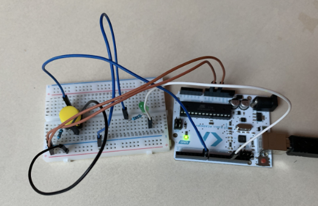
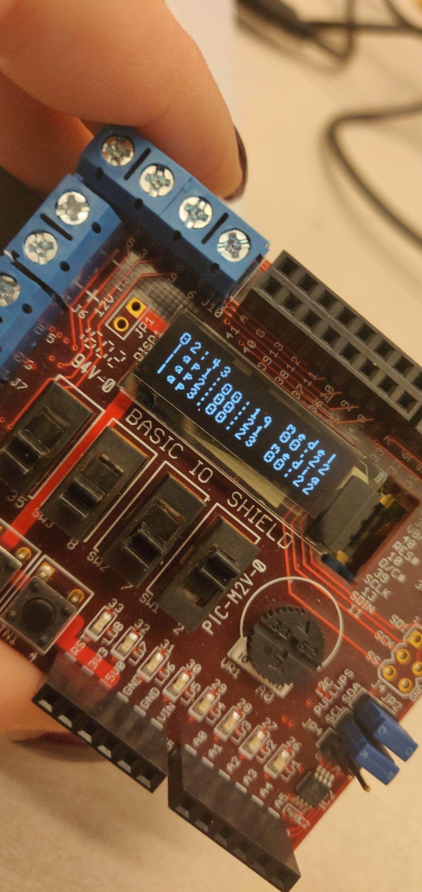

# E-Portfolio

### [IV1303 Modern Software Development at KTH, Project](pdf/Assignment_MADMM.pdf)

-Project in collaboration with 4 developers
During Mars 2020 me and my project partners made a website for an assignment,
this to showcase the importance of througly planned projects.
The webside was made for a resturant and was designed by the project group.
 This project was written in:
 -HTML
 -CSS

---
### [IE1206 Embedded Electronics at KTH, Project](/pdf/Arduino Projekt.pdf)

-Project in collaboration with project partner

During May 2019 me and my project partner developed a a LED lamp on
a arduino that was not bound to a button being pressed down.
 This project was written in:
 -Arduino code
    
---

###[IS1200 Computer Organization and. Components at KTH, Project], 2019

-Project in collaboration with project partner

During February 2019 me and my project partner developed a timer on
a microchip that could:
*save the times and loop up to 100.000 times with an efficient algorithm
*display average time
*refresh the average time after every loop
 This project was written in:
 -C
 -Assembly MIPS code
    
---

